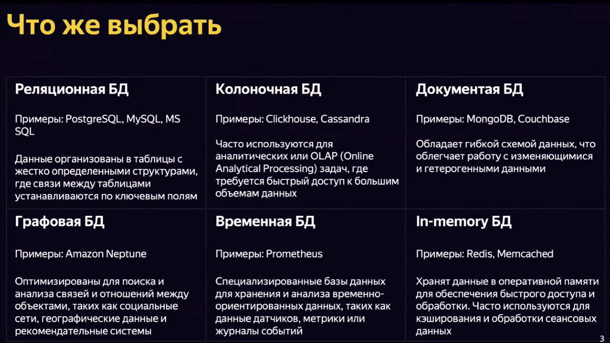

# Работа с БД из приложения и миграции


## Оригинал лекции
Оригинал лекции см. по [ссылке](https://www.youtube.com/watch?v=gLqmywFmEOY) на *YouTube*.


## Как выбрать БД?
Виды БД: реляционная (*PostgreSQL*, *MySQL*, *MS SQL*), колоночная (*Clickhouse*, *Cassandra*), документная (*MongoDB*, *Couchbase*), графовая (*Amazone Neptune*), временная (*Prometheus*), *in-memory* (*Redis*, *Memcahced*).

См. особенности каждого их типов БД ниже:


### Реляционные
**Задачи:** подходят для задач, связанных с онлайн-транзакциями и электронной коммерцией, системами учета, управления запасами, *CRM* и пр.

**Особенности:**
-   хранят данные в структурированном формате. Обеспечивается ясная структура и согласованность данных;
-   позволяют устанавливать отношения и зависимости между таблицами с помощью ключевых полей;
-   поддерживают транзакции, что обеспечивает атомарность, согласованность, изолированность и долговечность данных (*ACAD*-свойства).


### Документные (*NoSQL*)
**Задачи:** часто выбирают в качестве временной БД при начале разработки, т.к. позволяет почти безболезненно менять структуры данных и их зависимости. Хорошо применяется, если нет понимания того, какие данные будут необходимы в проекте.

**Особенности:** 
-   представляют свободное представление данных внутри ключа (как противопоставление реляционным БД);
-   каждый документ имеет собственный идентификатор и содержит все связанные данные внутри.
-   обладает гибкой структурой данных.


### Графовые
**Задачи:** полезны для анализа связей и моделирования социальных сетей, хранения геоданных.

**Особенности:**
-   основаны на графовой модели данных. Представляют данные в виде ребер и вершин, где ребра (связи) - связи, вершины (узлы) - данные;
-    структура может быть изменена без необходимости изменения схемы базы данных;
-    позволяют использовать алгоритмы поиска в графах.


### Выбираем реляционную БД
-   ***MySQL***. Имеет транзакционный *DML (Data Managment Layer)*. *GPL* лицензия (если хотим использовать весь код должен быть открытым, либо ...);
-   ***PostgreSQL***. ...
-   ***SQLite***. ...


## Как работать из приложения?
Базовые операции для работы с *DB* из *SDK* - методы по типу *res.NextRow()*, *res.Scan()*, *resScanNamed()*, *res.Err()* и пр.

Рекомендации:
-   Использование паттерна *Repository*. В отдельном пакете *internal/entities/user.go* заводим *struct User*, *struct UserWithPost* и пр. в качестве сущностей для работы с БД, уходим от функций и переходим в ООП режим, благодаря подобному подходу;
```golang
type repository struct {
    db *sqlx.DB
}
```
- Файл *assets/postgres/init.sql* с описанием *SQL*-инструкций для инициализации БД;
- Ф-ии, возвращающие строковые запросы для БД с передачей нужных параметров;
- Использование *RETURNING id*, для возврата *id*, сформировавшейся в БД записи;
- *Batch INSERT*, т.к. некоторые *INSERT* блокируют *SELECT* и пр. операции, то лучше делать добавление новых записей в БД порциями (для реляционных СУБД 100-1000 новых записей за раз). Можно объединить все в одну транзакцию, чтобы отменить все вставки в случае ошибки в одной из вставок;
- *UPSERT*-инструкция, существует не во всех БД, например, в *PostgreSQL* такого ключевого слова нету;
- *CONSTRAINT* на вставку неуникальных записей, отрицательных значений и пр.;
- *UNIQUE* *vs* *PRIMARY KEY* при масштабировании БД;
- Несогласованность при одновременных операциях вставки/удаления;
- *DELETE* также как и *INSERT* - опасная инструкция с точки зрения нагрузки на *CPU*, поэтому множественный *DELETE* также стоит осуществлять порциями;


### Транзакии
**Транзакция** — логическая единица работы, может состоять из нескольких операций, выполняемых в БД. Обеспечивает: атомарность, изоляцию, надежность, согласованность, целостность данных и параллельное выполнение;

Уровни изоляции:
-   *read uncommited* (чтение незафиксированных данных);
-   *read commited* (чтение фиксированных данных);
-   *repeatable read* (повторяющееся чтение);
-   *serializable* (упорядочиваемость).

За счет транзакций обеспечивается атомарность, т.к. транзакции гарантируют, что либо транзакция будет выполнена до конца либо не будет выполнена вообще.


### Архитектура кода
Ниже приведен пример архитектуры кода в проекте при работе с БД:


## *Query Builder*
*Query Builder* позволяет создавать, управлять и запрашивать БД при помощи высокоуровнего *API*, а не писать необработанные *SQL*-запросы.

См. примеры для *Go* на *GitHub*: [пример №1](https://github.com/doug-martin/goqu), [пример №2](https://github.com/leporo/sqlf), [пример №3](https://github.com/Masterminds/squirrel). 


## *ORM* (*Object-relational mapping*)
*ORM* (*Object-relational mapping*) — объектно-реляционное отображение — технология программирования, которая позволяет связывать БД с концепциями ООП, т.е. *ORM* — это прослойка между БД и кодом, который пишет программист, которая позволяет созданные в программе объекты складывать/получать из/в БД. См. примеры для *Go* на *GitHub*: [пример №1](https://github.com/go-pg/pg), [пример №2](https://github.com/go-gorm/gorm).   

Минусы *ORM*: не всегда пишет наиболее эффективные запросы + при усложнении запросов приходится переходить на обычные *SQL*-инструкции.


## Миграция
Цели миграции:
1. Изменение схемы БД. Например, для добавления новых таблиц, изменения существующих структур или удаления устаревших элементов;
2. Обновление ПО. Например, при обновлении приложений может потребоваться соответсвующее изменения БД для поддержки новых функций или исправления ошибок;
3. Изменение платформы или архитектуры. Например, при переходе на новую платформу или изменении архитектуры системы могут возникнуть потребности в переносе данных в новую БД.

Процесс: анализ -> планирование -> разработка -> тестирование -> резервное копирование -> миграция.
