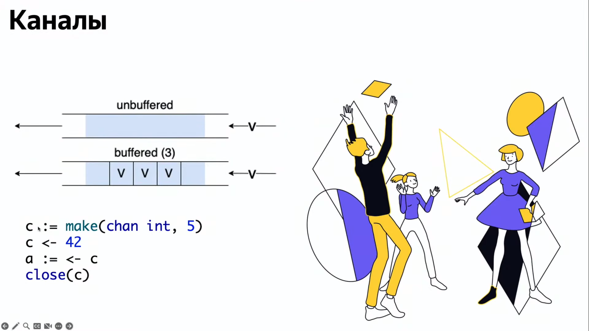

# Асинхронное программированеие (*Go*)


## Полезные материалы
|                           |                                                                                                                                 |
| ------------------------- | ------------------------------------------------------------------------------------------------------------------------------- |
| *Effective Go* оригинал   | См. по [ссылке](https://go.dev/doc/effective_go)                                                                                |
| *Effective Go* на русском | См. по [ссылке](https://github.com/Konstantin8105/Effective_Go_RU#%D0%9E%D0%B3%D0%BB%D0%B0%D0%B2%D0%BB%D0%B5%D0%BD%D0%B8%D0%B5) |
| *Habr* - каналы в *Go*    | См. по [ссылке](https://habr.com/ru/articles/490336/)                                                                           |


## Концепция многопоточности
Материалы с кодом к лекции по [ссылке](https://github.com/levdikpavel/multithreading) на *Github*.


### Однопоточность (*Single-threated process*)
Однопоточность - это когда каждое новое действие начинается только после завершения предыдущего. Например, при длительном сетевом запросе *CPU* простаивает(т.е. не используется), ожидая ответа.

### Многопоточность (*Multi-threated process*)
Основные концепции:
1. В ОС разные разные процессы используют разные адресные пространства;
2. По умолчанию процессы не взаимодействуют между собой;
3. В одном процессе может быть несколько потоков;
4. Разные потоки одного процесса могут совместно использовать адресное пространство процесса;
5. Если разные потоки одного процесса обращаются к одной области памяти процесса, то возникают проблемы конкуренции, синхронизации.

### Многопоточность в *Go*
- Горутины(*goroutines*) - легковесные потоки. В одном потоке может быть мн-во горутин.
- Планировщик *Go* сам распределяет горутины по потокам ОС;
- *Runtime Go* предоставляет удобные примитивы синхронизации между горутинами.

### Горутины(*goroutines*)
```golang
go func() {
    fmt.Println("Hello!")
}()
```

### Каналы(*chans*)
- "Труба", по которой горутины могут обмениваться данными;
- Синхронизируют исполнение в разных горутинах;
- Потокобезопасная очередь, т.к. запись/чтение в канал - атомарные действия;
- Можно определять каналы только для записи или только для чтения;
- Могут быть буферизованные (*buffered*) и небуферизованные (*unbufferred*);
- *Don't communicate by sharing memory; share memor  by communicating.*

Небуферизованный канал - прежде чем одна горутина запишет что-то в непустой канал, она дождется пока не появится другая горутина, которая из этого канала что-то считает. И, соответственно, наоборот для чтения, пока не появится другая горутина, которая не запишет что-то в канал - первая горутина будет ожидать:


В слудующей ф-ии в цикле *for* с использованием оператора *range* горутина будет читать из небуферизированного канала до тех пор пока он не закроется. Если в программе канал *in* так нигде и не закрывается - произойдет *deadlock*:
```golang
func square(in <-chan int, out chan<- int) {
	for i := range in {
		out <- i * i
	}
	close(out)
}
```

Механизм горутин и каналов достаточно легковесный, можно создавать миллионы горутин и каналов и это юудет выполняться на обычном железе.

Удобная возможность записать значение в канал из другого канала в одну строчку:
```golang
next <- <-prev
```

При чтении из закрытого канала в переменной *ok* типа *bool* будет значение *false*. Подобная конструкция полезна, когда необходимо понять, проискодит чтение из закрытого канала или из открытого:
```golang
x, ok := <-c
if ok != true {
    fmt.Println("Канал закрыт!")
}
```

Пример неблокирующей записи, если в текущий момент канал занят... выполнить какую-либо другую операцию:
```golang
select {
case c <- struct{}{}:
default:
    fmt.Println("skip fast job")
}
```

### Пакет *sync*
-   *sync.WaitGroup*;

Поскольку *main()* может закончиться быстрее, чем выполнятся все горутины (вспомнить пример, когда приходилось выполнять *time.Sleep()* в конце ф-ии *main()*) хотелось бы иметь механизм, который будет отслеживать выполнение всех запущенных горутин. *WaitGroup*-ы реализуют именно такой механизм.
 
-   *golang.org/x/sync/errgroup*;

Похожий механизм на предыдущий, только используется для отлова ошибок при выполнении горутин. Т.е. используются ошибки вместо счетчиков в *WaitGroup*.

-   *sync.Mutex()*, *RWMutex*;

Один из механизмов решения проблемы конкурентного доступа(чтение/запись) к объектам. Пример использования *mutex* в классе, ф-ии *s.mu.Lock()* и *s.mu.Unlock()* используются для блокирования/разблокирования используемых ресурсов (вызываются через оператор *defer*):
```golang
type storage struct {
	m  map[int]int
	mu sync.Mutex
}
```

-   *sync.Once()*.

`var once sync.Once` позволяет выполнить действие однократно, например, миллион горутин вызываются с *once.Do(func() {...some action...})* то *some action* выполнится один раз. Обычно используется для инициализации тяжеловесных структур, которые очень редко появляется необходимость инициализировать.

P.S: для однократного действия в коде удобно использовать:
```golang
func init() {
	fmt.Println("Hello from init()!")
}
```

### Пакет *atomic*
- atomic.AddInt64();

Т.к. инкремент счетчика внутри горутины не является атомарной операцией, то необходимы механизмы для удобной работы со счетчиками:
```golang
for i := 0; i < 1e5; i++ {
    go func() {
        atomic.AddInt64(&count, 1)
    }()
}
```

- atomic.Int64 (+ Swap/CompareAndSwap);

Аналогично предыдущему примеру, только для работы со счетчиками используется структура *atomic.Int64*. Для операций используютяся методы по типу *Add()*, для чтения *Load()*. Еще есть метод *Swap(...some value...)*, который возвращает старое значение обекта и записывает в него новое.

- atomic.Value.

...